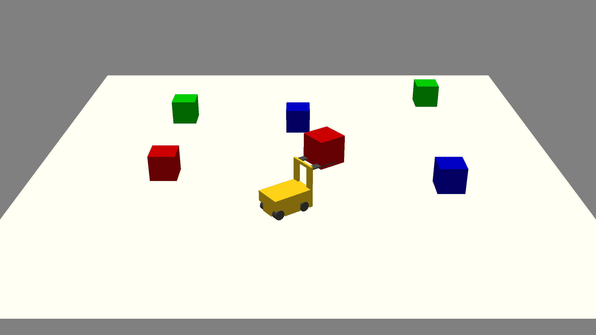

# Forklift Simulator

Author: Nolan Mass

Design: Control a miniature forklift and move different colored boxes around.

Screen Shot:

How To Play:

Use the arrow keys to drive the forklift. Use E to raise the life and Q to lower it.
Pick up blocks by lowering the lift, driving up to a block, and raising the lift. Drop the block off by lowering the lift all the way down and backing away.
Change the view with WASD and the mouse

Sources:

This game was built with [NEST](NEST.md).

